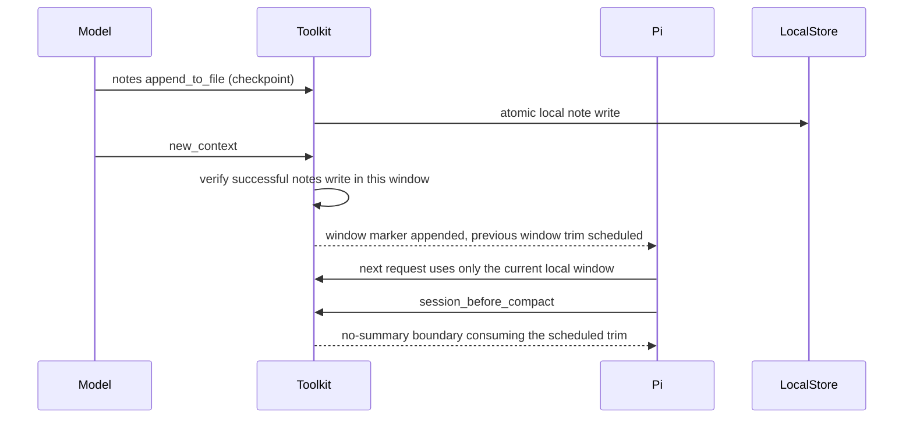

# Toolkit Internals

Developer-facing reference for [pi-openai-toolkit](../README.md). If changing context transport or compaction strategy, start here.

## Table of Contents

- [Local Context protocol](#local-context-protocol)
- [Rollover lifecycle](#rollover-lifecycle)
- [Remote Compaction v2 wire contract](#remote-compaction-v2-wire-contract)
- [Artifacts and debugging](#artifacts-and-debugging)
- [Provenance](#provenance)

## Local Context protocol

With `compaction.contextManagement: "auto"`, every provider, including native `openai-codex`, uses the local history/notes and context-window implementation.

- `history` indexes explicitly registered Pi session sources in task-scoped SQLite and returns only the selected agent scope.
- `notes` reads and writes task- and agent-scoped virtual files under the local context-management root.
- Window boundaries are local `codex-context-window` custom messages. They trim prior windows from the live prompt without emitting hosted window metadata or headers.
- The local payload path uses unencrypted namespace schemas. It retains normal model reasoning items. Opaque encrypted history/notes records from a prior hosted session are replaced with an omission marker instead of being forwarded as local content.

No active context-management path resolves Codex OAuth, calls an alpha history/notes endpoint, sends hosted context headers, or rewrites tool output into `encrypted_content`. `gatewayContextModels` is legacy configuration only and does not select a context backend. Existing remote helper modules remain compatibility utilities; remote context-data migration is not provided.

## Rollover lifecycle

The `new_context` happy path, end to end:

State invariants the lifecycle code must keep honest:

- The checkpoint gate verifies a *successful* `notes` `append_to_file` / `write_file` against the persisted session branch after the latest window boundary, so it survives restarts and forks.
- Budget checks are skipped until the current window has produced its own assistant usage; acting on the previous window's usage anchor burns the once-per-window reminder on a false alarm.
- The scheduled trim is consumed exactly once, synchronously, by the first compaction attempt whose boundary window id matches. Every other context-management compaction path (threshold without a scheduled rollover, manual `/compact`, overflow) is cancelled.
- A window boundary is persisted as a `codex-context-window` custom message; `session_start` replays boundaries from the branch and rebuilds identity after forks.

## Remote Compaction v2 wire contract

This is independent of local Context Management. A `compaction_trigger` item appended to the live streaming request yields one output item of `type: "compaction"` with non-empty `encrypted_content`, stored in `CompactionEntry.details.compactedWindow`. On later requests the opaque checkpoint is replayed ahead of live turns: zero-loss, no text summary. Replay fails closed: if the summary anchor cannot be located, the request is aborted with a notification and a content-free failure artifact; the sentinel-only payload is never sent. A v2 response with a missing or empty checkpoint is never stored, and the `nativeFallback` tier is skipped: Pi's own threshold drives the next attempt, which may use `remoteCompactModel` when configured. `remoteCompactModel` must resolve to the same effective base URL as the active model.

## Artifacts and debugging

With `debug: true` the toolkit writes lifecycle and compaction artifacts under `artifactRoot` (default `~/.pi/agent/artifacts/pi-openai-toolkit/compaction`):

- each `session_start` writes a lifecycle artifact whose `activation` field records local activation or the `tool-name-conflict` inactive reason;
- `logProviderPayloads` additionally writes raw provider request payloads, `logCompactResponses` the compact SSE bodies; keep both off unless inspecting a specific request;
- artifacts always redact Authorization credentials, API keys/tokens, Codex account ids, and opaque `encrypted_content` / `encrypted_output`, even with `redactSensitiveData: false`.

## Provenance

The retired hosted Context compatibility utilities were reverse-engineered from `@howaboua/pi-codex-conversion@3.0.29` (source commit `7021ae48e8efe36a3becc5830d529696ff798e5e`). The Astra compatibility layer is adapted from Oh My Pi 18.1.8 (MIT). Web Search behavior was adapted from [`pi-openai-web-search`](https://github.com/code-yeongyu/pi-openai-web-search) (commit `3964338`). Attribution details are in [NOTICE](../NOTICE).
